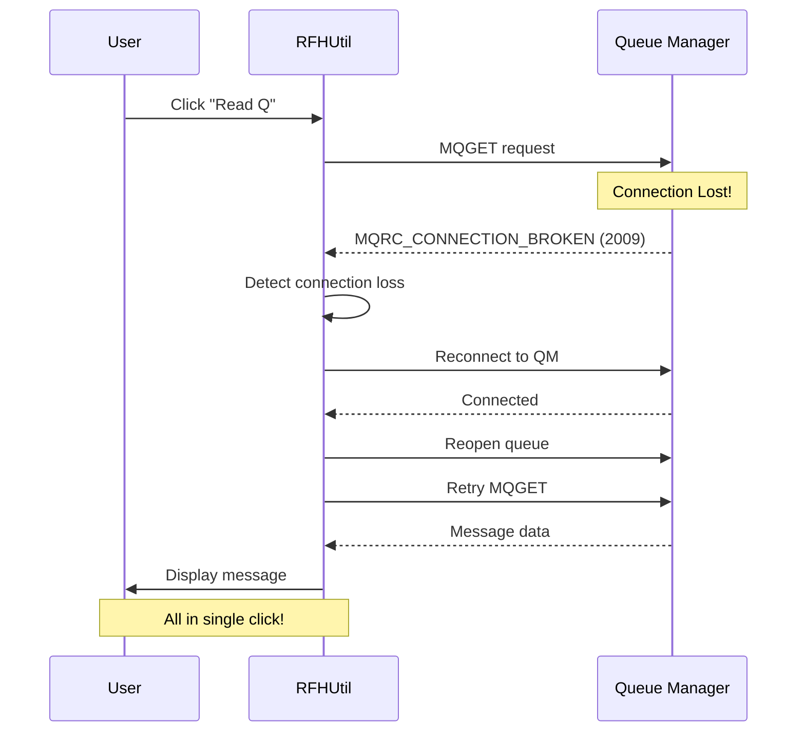
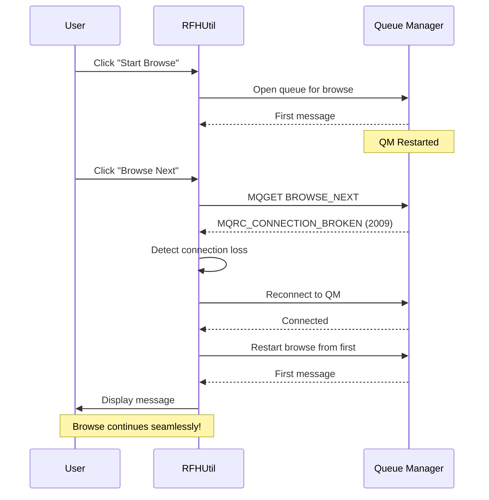

# mq-rfhutil
This repository contains the **rfhutil** program, originally released
in SupportPac IH03. Both source code and binaries are included.

This program can be useful for the development and testing of IBM MQ and
IBM Integration Bus aka WebSphere Message Broker aka App Connect Enterprise applications.
Test messages are stored as files, which are then read by the application and written to an MQ queue. The program is GUI based.

## Latest Features (v9.4.0.0)

### 🎨 Dark Mode Support
RFHUtil now includes full dark mode support with automatic theme detection and manual theme switching.

**Light Mode:**
<!-- TODO: Add screenshot of light mode interface -->

**Dark Mode:**
<!-- TODO: Add screenshot of dark mode interface -->

**Theme Menu:**
<!-- TODO: Add screenshot of theme menu -->

### 🔄 Enhanced Connection Reliability

RFHUtil now features intelligent automatic reconnection that seamlessly handles queue manager restarts and connection losses.

#### Key Features
- **HeartBeat/KeepAlive Configuration**: Fine-tune connection monitoring for optimal reliability
- **Automatic Reconnection**: Seamlessly reconnects to queue managers with configurable retry logic
- **Single-Click Recovery**: Operations complete in one click after reconnection - no manual intervention needed
- **Browse Operation Recovery**: Automatically restarts browse operations after reconnection
- **Connection Settings UI**: New dedicated tab for managing all connection parameters

#### How It Works

When a connection is lost (e.g., queue manager restart), RFHUtil automatically:
1. Detects the connection failure
2. Attempts to reconnect to the queue manager
3. Reopens the queue
4. Completes the requested operation
5. All in a **single button click** - no error dialogs, no manual reconnection needed!

**Read Q Operation Flow:**

**Browse Operation Flow:**

#### Benefits
- ✅ **No manual reconnection** - Everything happens automatically
- ✅ **No error popups** - Status messages appear in the log window
- ✅ **Single click operation** - No need to click twice after reconnection
- ✅ **Browse state preserved** - Browse operations continue from where they left off
- ✅ **Configurable retry logic** - Customize reconnection attempts and intervals

**Connection Settings Tab:**
<!-- TODO: Add screenshot of connection settings tab -->

**Reconnection in Action:**
<!-- TODO: Add screenshot showing reconnection log messages -->

## Possible Uses
It allows test messages to be captured and stored in files, and then used to drive Message Flows. Output messages can also be read and displayed in a variety of formats. The formats include two types of XML as well as matched against a COBOL copybook. The data can be in EBCDIC or ASCII. An RFH2 header can be added to the message before the message is sent.

## Skill Level Required
None beyond basic MQ and IIB/ACE development skills.

## Contents of repository
This repository contains source code for the rfhutil program, managed as a Microsoft Visual Studio 2017 Solution.
If you have VS 2017, then opening the `RFHUtil.sln` file will allow you to rebuild the program.

Pre-built copies of the programs (**rfhutil** for connections to a local queue manager, **rfhutilc** for MQ client connections) are
under the `bin\Release` directory. They can be run directly but
you may first need to run the `setmqenv` program to set the environment variables that allow you to locate the MQ runtime libraries.

Documentation is provided in the `ih03.doc` and `ih03.pdf` files.

## Building and running the programs
The VS 2017 configuration assumes that MQ is installed in the default location, C:\Program Files\IBM\MQ. If you have installed MQ
elsewhere, then you may consider adding a link from the default location to your installation directory. Otherwise, you will
have to modify the configuration properties.

Running the programs may require that you run `setmqenv` to set a suitable environment for the programs to locate the MQ
libraries.

### Performance testing tools
The IH03 SupportPac also included some independent performance testing programs. Those programs are included in this repository under
the `mqperf` subdirectory. There is a Visual Studio 2017 Solution configuration to rebuild those tools included. Generated executables
are also shipped in the `bin\Release` tree.

The performance testing programs are provided in a **single configuration**, linked with the mqm.dll. That can work for both client connections
and local queue managers. To **force** connections to be made across a client channel, then set the `MQ_CONNECT_TYPE` environment
variable to `CLIENT`.

## History
The **rfhutil** program was conceived, created and developed by **Jim MacNair**.

See [CHANGELOG](CHANGELOG.md) for changes to the program since its inception. The first release to Github is called version 9.1, and was released in December 2018.

## Health Warning

This package is provided as-is with no guarantees of support or updates.

## Issues and Contributions

For feedback and issues relating specifically to this package, please use the
[GitHub issue tracker](https://github.com/ibm-messaging/mq-rfhutil/issues).

Contributions to this package can be accepted under the terms of the
IBM Contributor License Agreement, found in the file [CLA.md](CLA.md) of this repository.
When submitting a pull request, you must include a statement stating
you accept the terms in the CLA.
