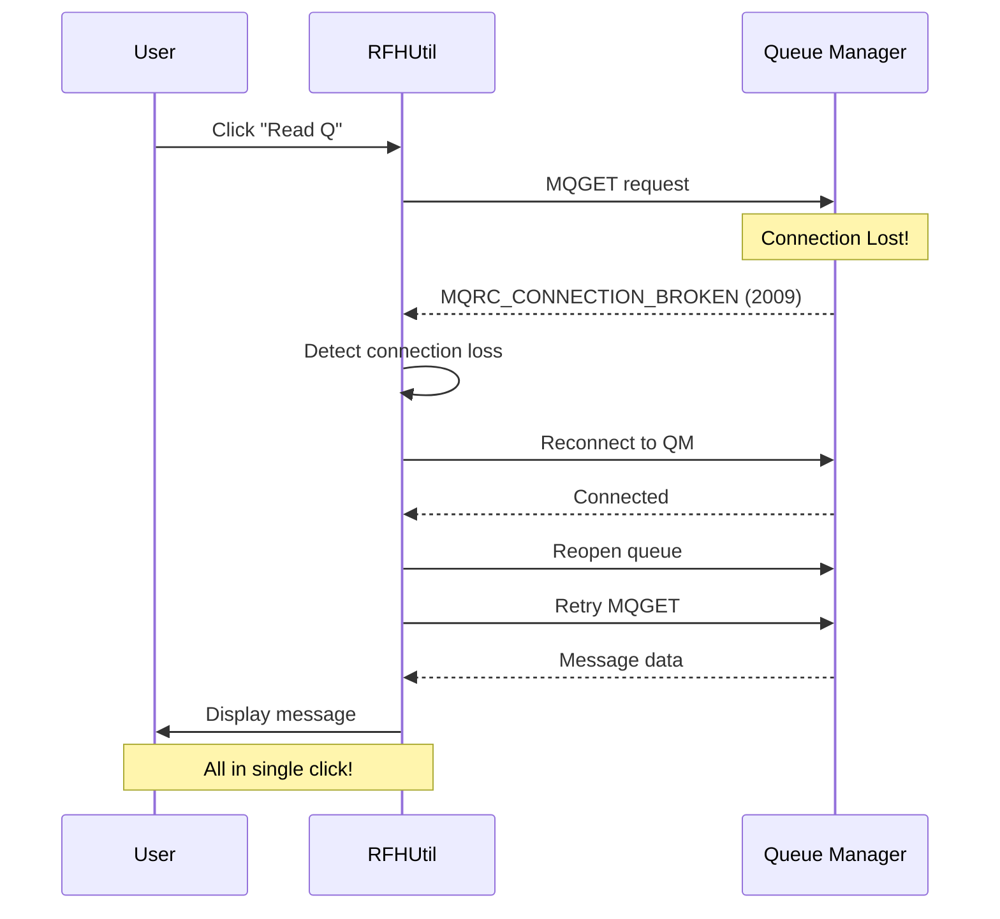
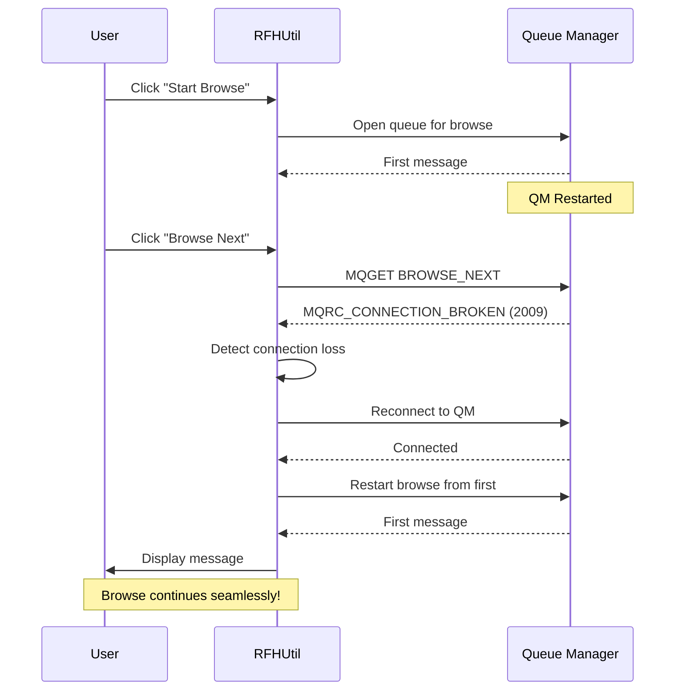

# mq-rfhutil

This is a fork of the **rfhutil** program, originally released in SupportPac IH03 and maintained by IBM Messaging.

**Original Repository**: [ibm-messaging/mq-rfhutil](https://github.com/ibm-messaging/mq-rfhutil)

This program can be useful for the development and testing of IBM MQ and
IBM Integration Bus aka WebSphere Message Broker aka App Connect Enterprise applications.
Test messages are stored as files, which are then read by the application and written to an MQ queue. The program is GUI based.
## 🎉 What's New in Version 9.4.0.0

**Released:** February 2026  
**Build:** 234

### Major Improvements

#### 🔌 Enhanced Connection Reliability (P0)
- **HeartBeat Configuration** - Configurable MQ HeartBeat intervals (default 60s) for fast failure detection
- **KeepAlive Support** - TCP KeepAlive configuration to prevent firewall timeouts
- **Automatic Reconnection** - Intelligent reconnection with exponential backoff (1s → 2s → 4s → 8s → 16s → 32s → 60s)
- **Connection Settings UI** - New dedicated tab for managing connection parameters

#### 🎨 Dark Mode Support (P1.2)
- **Three Theme Modes** - Light, Dark, and System (follows Windows theme)
- **Modern UI** - Gradient backgrounds, themed buttons, and dark grey controls
- **Persistent Preferences** - Theme choice saved between sessions
- **All Dialogs Themed** - Consistent dark mode across all 15 property pages

#### 🔧 Build System Updates (P1.1 & P1.3)
- **Visual Studio 2022** - Upgraded to VS 2022 Build Tools (v143 toolset)
- **IBM MQ 9.4** - Updated for IBM MQ 9.4.5 compatibility
- **64-bit Support** - Full x64 platform support alongside Win32 builds

### Quick Start with New Features

#### Using Dark Mode
1. Launch RFHUtil
2. Go to **View → Theme** menu
3. Choose:
   - **Light Mode** - Traditional light theme
   - **Dark Mode** - Modern dark theme
   - **System Default** - Follows Windows 10/11 theme

#### Configuring Connection Settings
1. Open the **Connection Settings** tab (15th tab)
2. Configure:
   - **HeartBeat Interval** - Set MQ heartbeat (recommended: 60 seconds)
   - **KeepAlive Interval** - Set TCP keepalive (use AUTO for OS defaults)
   - **Auto-Reconnect** - Enable automatic reconnection on connection loss
   - **Reconnect Attempts** - Set maximum retry attempts (default: 7)

### Documentation
- 📚 [Complete Documentation](docs/README.md)
- 🗺️ [Modernization Roadmap](MODERNIZATION_ROADMAP.md)
- 📝 [Changelog](CHANGELOG.md)

---


## Overview

### 🔒 Safe Mode (Browse-Only Version) - NEW!

This fork adds a **Safe Mode** build configuration that creates a browse-only version (`rfhutilc-safe.exe`) with all write operations disabled.

#### Key Features
- **Browse-Only Operations**: All message reads use non-destructive browse mode
- **Disabled Write Operations**: Write Q, Load Q, Move Q, Purge Q, and Clear All are completely disabled
- **Production-Safe**: Perfect for troubleshooting production environments without risk of data modification
- **Training-Friendly**: Ideal for training new team members without fear of accidental changes
- **Compliance-Ready**: Meets requirements for read-only access in regulated environments

#### What's Disabled in Safe Mode
- ❌ Write Q - Cannot write messages to queues
- ❌ Load Q - Cannot load messages from files to queues
- ❌ Move Q - Cannot move messages between queues
- ❌ Purge Q - Cannot clear messages from queues
- ❌ Clear All - Cannot clear all data
- ❌ Destructive Reads - All reads automatically use browse mode

#### What's Still Available
- ✅ Browse Operations - Start Browse, Browse Next, Browse Previous
- ✅ Save Q - Save messages to files (read-only operation)
- ✅ Display Q - View queue information
- ✅ Read Files - Load and view message data from files
- ✅ All Analysis Tools - Parse, format, and analyze message content

#### Building Safe Mode

**Win32 (32-bit):**
```bash
"C:\Program Files (x86)\Microsoft Visual Studio\2022\BuildTools\MSBuild\Current\Bin\MSBuild.exe" RFHUtil.sln /t:Client:Rebuild /p:Configuration=ReleaseSafe /p:Platform=Win32 /v:minimal
```
Output: `bin\ReleaseSafe\rfhutilc-safe.exe`

**x64 (64-bit):**
```bash
"C:\Program Files (x86)\Microsoft Visual Studio\2022\BuildTools\MSBuild\Current\Bin\MSBuild.exe" RFHUtil.sln /t:Client:Rebuild /p:Configuration=ReleaseSafe /p:Platform=x64 /v:minimal
```
Output: `bin\ReleaseSafe\x64\rfhutilc-safe.exe`

Or use the convenient build script:
```bash
build.cmd safe      # Build Win32 safe mode
build.cmd safe-x64  # Build x64 safe mode
```

See [SAFE_MODE_IMPLEMENTATION.md](docs/SAFE_MODE_IMPLEMENTATION.md) and [BUILD_CONFIG.md](docs/BUILD_CONFIG.md) for detailed implementation information.

## Additional Features

### 🎨 Dark Mode Support
RFHUtil now includes full dark mode support with automatic theme detection and manual theme switching.

**Light Mode:**


**Dark Mode:**


**Theme Menu:**


### 🔄 Enhanced Connection Reliability

RFHUtil now features intelligent automatic reconnection that seamlessly handles queue manager restarts and connection losses.

#### Key Features
- **HeartBeat/KeepAlive Configuration**: Fine-tune connection monitoring for optimal reliability
- **Automatic Reconnection**: Seamlessly reconnects to queue managers with configurable retry logic
- **Single-Click Recovery**: Operations complete in one click after reconnection - no manual intervention needed
- **Browse Operation Recovery**: Automatically restarts browse operations after reconnection
- **Connection Settings UI**: New dedicated tab for managing all connection parameters

#### How It Works

When a connection is lost (e.g., queue manager restart), RFHUtil automatically:
1. Detects the connection failure
2. Attempts to reconnect to the queue manager
3. Reopens the queue
4. Completes the requested operation
5. All in a **single button click** - no error dialogs, no manual reconnection needed!

**Read Q Operation Flow:**

```mermaid
sequenceDiagram
    participant User
    participant RFHUtil
    participant QM as Queue Manager
    
    User->>RFHUtil: Click "Read Q"
    RFHUtil->>QM: MQGET request
    Note over QM: Connection Lost!
    QM-->>RFHUtil: MQRC_CONNECTION_BROKEN (2009)
    RFHUtil->>RFHUtil: Detect connection loss
    RFHUtil->>QM: Reconnect to QM
    QM-->>RFHUtil: Connected
    RFHUtil->>QM: Reopen queue
    RFHUtil->>QM: Retry MQGET
    QM-->>RFHUtil: Message data
    RFHUtil->>User: Display message
    Note over User,RFHUtil: All in single click!
```

**Browse Operation Flow:**

```mermaid
sequenceDiagram
    participant User
    participant RFHUtil
    participant QM as Queue Manager
    
    User->>RFHUtil: Click "Start Browse"
    RFHUtil->>QM: Open queue for browse
    QM-->>RFHUtil: First message
    Note over QM: QM Restarted
    User->>RFHUtil: Click "Browse Next"
    RFHUtil->>QM: MQGET BROWSE_NEXT
    QM-->>RFHUtil: MQRC_CONNECTION_BROKEN (2009)
    RFHUtil->>RFHUtil: Detect connection loss
    RFHUtil->>QM: Reconnect to QM
    QM-->>RFHUtil: Connected
    RFHUtil->>QM: Restart browse from first
    QM-->>RFHUtil: First message
    RFHUtil->>User: Display message
    Note over User,RFHUtil: Browse continues seamlessly!
```

#### Benefits
- ✅ **No manual reconnection** - Everything happens automatically
- ✅ **No error popups** - Status messages appear in the log window
- ✅ **Single click operation** - No need to click twice after reconnection
- ✅ **Browse state preserved** - Browse operations continue from where they left off
- ✅ **Configurable retry logic** - Customize reconnection attempts and intervals

**Connection Settings Tab:**
<!-- TODO: Add screenshot of connection settings tab -->


**Reconnection in Action:**
<!-- TODO: Add screenshot showing reconnection log messages -->


## Possible Uses
It allows test messages to be captured and stored in files, and then used to drive Message Flows. Output messages can also be read and displayed in a variety of formats. The formats include two types of XML as well as matched against a COBOL copybook. The data can be in EBCDIC or ASCII. An RFH2 header can be added to the message before the message is sent.

## Skill Level Required
None beyond basic MQ and IIB/ACE development skills.

## Contents of repository
This repository contains source code for the rfhutil program, managed as a Microsoft Visual Studio 2022 Solution.
If you have VS 2022, then opening the `RFHUtil.sln` file will allow you to rebuild the program.

Pre-built copies of the programs are available in both **Win32 (32-bit)** and **x64 (64-bit)** versions:

**Win32 Builds:**
- **rfhutil.exe** - Full version for connections to a local queue manager (`bin\Release`)
- **rfhutilc.exe** - Client version for MQ client connections (`bin\Release`)
- **rfhutilc-safe.exe** - Browse-only safe mode version (`bin\ReleaseSafe`)

**x64 Builds:**
- **rfhutil.exe** - Full version for connections to a local queue manager (`bin\Release\x64`)
- **rfhutilc.exe** - Client version for MQ client connections (`bin\Release\x64`)
- **rfhutilc-safe.exe** - Browse-only safe mode version (`bin\ReleaseSafe\x64`)

They can be run directly but you may first need to run the `setmqenv` program to set the environment variables that allow you to locate the MQ runtime libraries.

Documentation is provided in the `ih03.doc` and `ih03.pdf` files.

## Building and running the programs

### Build Requirements
- **Visual Studio 2022** with C++ Desktop Development workload
- **IBM MQ 9.4.5** Client (both 32-bit and 64-bit for full platform support)
- **Windows SDK 10.0**

### Platform Support
The project now supports both **Win32 (32-bit)** and **x64 (64-bit)** platforms:

**Win32 builds** use MQ libraries from: `C:\Program Files (x86)\IBM\MQ\tools\lib`
**x64 builds** use MQ libraries from: `C:\Program Files\IBM\MQ\tools\lib64`

If you have installed MQ elsewhere, you may consider adding a link from the default location to your installation directory. Otherwise, you will have to modify the configuration properties.

### Quick Build Commands
Use the convenient `build.cmd` script:

```bash
# Win32 builds
build.cmd rfhutil    # Build RFHUtil (Win32)
build.cmd client     # Build Client (Win32)
build.cmd safe       # Build Safe Mode (Win32)
build.cmd all        # Build all Win32 projects

# x64 builds
build.cmd rfhutil-x64  # Build RFHUtil (x64)
build.cmd client-x64   # Build Client (x64)
build.cmd safe-x64     # Build Safe Mode (x64)
build.cmd all-x64      # Build all x64 projects

# Build both platforms
build.cmd all-both   # Build all projects for both Win32 and x64
```

Running the programs may require that you run `setmqenv` to set a suitable environment for the programs to locate the MQ
libraries.

### Performance testing tools
The IH03 SupportPac also included some independent performance testing programs. Those programs are included in this repository under
the `mqperf` subdirectory. There is a Visual Studio 2017 Solution configuration to rebuild those tools included. Generated executables
are also shipped in the `bin\Release` tree.

The performance testing programs are provided in a **single configuration**, linked with the mqm.dll. That can work for both client connections
and local queue managers. To **force** connections to be made across a client channel, then set the `MQ_CONNECT_TYPE` environment
variable to `CLIENT`.


## History

The **rfhutil** program was conceived, created and developed by **Jim MacNair**.

### Version History

| Version | Build | Release Date | Key Features | Status |
|---------|-------|--------------|--------------|--------|
| **9.4.0.0** | 234 | Feb 2026 | Dark Mode, Connection Reliability, Auto-Reconnect, 64-bit Support | ✅ Current |
| 9.1.6 | 233 | Oct 2021 | TLS cipher updates, CSP improvements | Stable |
| 9.1.5 | 232 | Apr 2021 | MQDLH fixes, trace improvements | Stable |
| 9.1.4 | 231 | Apr 2021 | TLS 1.3 support, MQMD fixes | Stable |
| 9.1.3 | 230 | Jun 2019 | Registry updates | Stable |
| 9.1.2 | 229 | Mar 2019 | XML parsing fixes | Stable |
| 9.1.1 | 228 | Feb 2019 | Code analysis, TLS password fix | Stable |
| 9.1.0 | 227 | Dec 2018 | First GitHub release | Stable |
| 9.0.0 | 226 | Nov 2018 | VS 2017 upgrade, high DPI support | Legacy |
| 9.0.0 | 225 | Oct 2018 | VS 2017 migration | Legacy |
| 8.0.0 | 224 | Dec 2015 | JSON parser improvements | Legacy |

### Recent Changes (v9.4.0.0)

#### Connection Reliability (P0)
- **P0.1:** HeartBeat/KeepAlive configuration with UI controls
- **P0.2:** Automatic reconnection with exponential backoff
- **P0.3:** Dedicated Connection Settings tab with 28 controls

#### User Interface (P1)
- **P1.1:** Visual Studio 2022 upgrade (v143 toolset)
- **P1.2:** Complete dark mode support with gradient backgrounds

#### Technical Improvements
- IBM MQ 9.4.5 compatibility
- Enhanced error handling (7 reconnection scenarios)
- Theme persistence via registry
- System theme detection (Windows 10+)

### This Fork
This fork adds Safe Mode (browse-only) functionality to provide a production-safe version of rfhutilc for environments where read-only access is required.

**Original Repository**: [ibm-messaging/mq-rfhutil](https://github.com/ibm-messaging/mq-rfhutil)

### Documentation
See [CHANGELOG.md](CHANGELOG.md) for detailed change history.

## Health Warning

This package is provided as-is with no guarantees of support or updates.

## Issues and Contributions

For issues relating to the **original rfhutil**, please use the [IBM Messaging issue tracker](https://github.com/ibm-messaging/mq-rfhutil/issues).

For issues relating to the **Safe Mode feature** in this fork, please use this repository's issue tracker.

Contributions to the original package can be accepted under the terms of the
IBM Contributor License Agreement, found in the file [CLA.md](CLA.md) of this repository.
