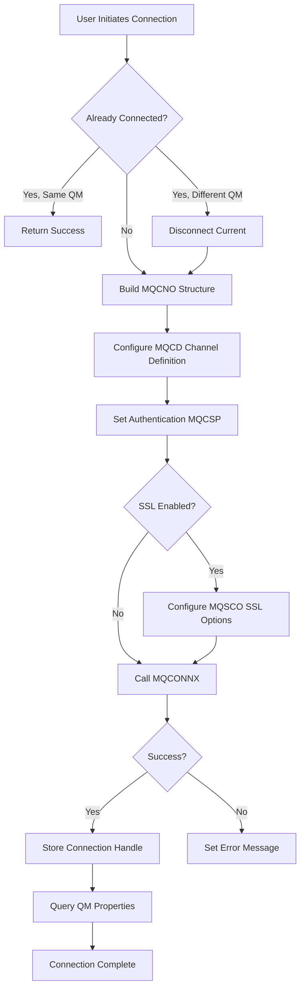

# RFHUtil Project - Architecture & Modernization Analysis

## Executive Summary

This document provides a comprehensive analysis of the mq-rfhutil project, covering:
1. **Architecture and Code Organization**
2. **Modernization Opportunities**
3. **Connection Management & Channel Keepalive Analysis**

---

## 1. Architecture and Code Organization

### 1.1 Project Structure

```
mq-rfhutil/
├── RFHUtil/          # Main GUI application (MFC-based)
├── Client/           # Client variant build configuration
├── mqperf/           # Performance testing tools suite
├── bin/Release/      # Pre-built executables
└── Documentation/    # User guides (ih03.pdf, ih03.doc)
```

### 1.2 Technology Stack

| Component | Technology |
|-----------|-----------|
| **Language** | C++ |
| **GUI Framework** | Microsoft Foundation Classes (MFC) |
| **Build System** | Visual Studio 2017 (v141 toolset) |
| **Platform** | Windows 32-bit (Win32) |
| **SDK** | Windows 10 SDK (10.0.17134.0) |
| **MQ Integration** | IBM MQ Client/Server libraries (mqm.dll) |
| **Version** | 9.1.6 (Build 233, October 2021) |

### 1.3 Core Components

#### Main Application (RFHUtil)

**Document-View Architecture (MFC Pattern)**

```
rfhutilApp (Application)
    ├── MainFrm (Main Window Frame)
    ├── rfhutilDoc (Document - Data Model)
    ├── rfhutilView (View - UI Presentation)
    └── DataArea (Core Business Logic & MQ Operations)
```

**Key Classes and Responsibilities:**

1. **DataArea** ([`DataArea.cpp`](RFHUtil/DataArea.cpp:1), [`DataArea.h`](RFHUtil/DataArea.h:1))
   - Central data management class (~23,000+ lines)
   - MQ connection management
   - Queue operations (MQOPEN, MQGET, MQPUT, MQCLOSE)
   - Message parsing and formatting
   - File I/O operations
   - Pub/Sub operations

2. **General** ([`General.cpp`](RFHUtil/General.cpp:1), [`General.h`](RFHUtil/General.h:1))
   - Main property page
   - Queue manager and queue selection
   - Connection parameters
   - User interface controls

3. **MQMD Page** ([`MQMDPAGE.cpp`](RFHUtil/MQMDPAGE.cpp:1))
   - MQ Message Descriptor editing
   - Message properties configuration

4. **Message Format Handlers:**
   - **RFH** ([`RFH.cpp`](RFHUtil/RFH.cpp:1)) - RFH/RFH2 header processing
   - **CICS** ([`CICS.cpp`](RFHUtil/CICS.cpp:1)) - CICS header support
   - **IMS** ([`Ims.cpp`](RFHUtil/Ims.cpp:1)) - IMS header support
   - **DLQ** ([`Dlq.cpp`](RFHUtil/Dlq.cpp:1)) - Dead Letter Queue header
   - **JMS** ([`jms.cpp`](RFHUtil/jms.cpp:1)) - JMS message support
   - **PubSub** ([`PubSub.cpp`](RFHUtil/PubSub.cpp:1)) - Pub/Sub operations

5. **Utility Classes:**
   - **comsubs** ([`comsubs.cpp`](RFHUtil/comsubs.cpp:1)) - Common subroutines (encoding, time, memory)
   - **mqsubs** ([`mqsubs.cpp`](RFHUtil/mqsubs.cpp:1)) - MQ-specific utilities
   - **Copybook** ([`Copybook.cpp`](RFHUtil/Copybook.cpp:1)) - COBOL copybook parsing
   - **JsonParse** ([`JsonParse.cpp`](RFHUtil/JsonParse.cpp:1)) - JSON parsing

#### Performance Testing Tools (mqperf)

Independent command-line tools for MQ performance testing:

| Tool | Purpose |
|------|---------|
| **mqcapone** | Capture single message |
| **mqcapsub** | Capture subscription messages |
| **mqcapture** | General message capture |
| **mqlatency** | Measure message latency |
| **mqput2** | Put messages with timing |
| **mqputs** | Bulk message puts |
| **mqreply** | Request/reply testing |
| **mqtest** | General MQ testing |
| **mqtimes** (1-3) | Various timing tests |

**Common Subroutines** ([`mqperf/CommonSubs/`](mqperf/CommonSubs/)):
- [`comsubs.c`](mqperf/CommonSubs/comsubs.c:1) - Common utilities
- [`qsubs.c`](mqperf/CommonSubs/qsubs.c:1) - Queue operations
- [`rfhsubs.c`](mqperf/CommonSubs/rfhsubs.c:1) - RFH handling
- [`timesubs.c`](mqperf/CommonSubs/timesubs.c:1) - Timing utilities

### 1.4 Build Configurations

**Two Main Variants:**

1. **rfhutil.exe** - Server bindings (local queue manager)
   - Links directly to MQ server libraries
   - Faster performance for local QM access
   - No network overhead

2. **rfhutilc.exe** - Client connections (remote queue manager)
   - Uses MQ client libraries
   - Connects via channels (TCP/IP, etc.)
   - Supports SSL/TLS
   - Controlled by `MQCLIENT` preprocessor directive

---

## 2. Connection Management & Channel Keepalive Analysis

### 2.1 Connection Architecture

**Connection Flow:**



### 2.2 Connection Implementation Details

**Key Code Location:** [`DataArea::connect2QM()`](RFHUtil/DataArea.cpp:10350-10850)

**Connection Structures Used:**

1. **MQCNO** (Connection Options) - Version 2/5
   ```cpp
   cno.Version = MQCNO_VERSION_2;
   cno.Options = MQCNO_HANDLE_SHARE_NO_BLOCK;
   cno.ClientConnPtr = &cd;
   cno.SecurityParmsPtr = &csp; // If using CSP
   ```

2. **MQCD** (Channel Definition) - Version 4/7
   ```cpp
   cd.Version = MQCD_VERSION_4;
   cd.MaxMsgLength = 104857600; // 100MB
   cd.TransportType = MQXPT_TCP; // or other
   ```

3. **MQCSP** (Security Parameters) - For authentication
   ```cpp
   csp.AuthenticationType = MQCSP_AUTH_USER_ID_AND_PWD;
   csp.CSPUserIdPtr = userid;
   csp.CSPPasswordPtr = password;
   ```

4. **MQSCO** (SSL Configuration) - For TLS/SSL
   ```cpp
   sco.KeyRepository = ssl_keyr;
   cd.SSLCipherSpec = cipher_spec;
   cd.SSLClientAuth = MQSCA_REQUIRED/OPTIONAL;
   ```

### 2.3 Channel Keepalive & Reconnection Analysis

#### ⚠️ **CRITICAL FINDINGS:**

**1. NO Automatic Reconnection Logic**
- The application does **NOT** implement automatic reconnection
- If connection is lost, user must manually reconnect
- No retry mechanism for transient network failures

**2. NO Explicit Keepalive Configuration**
- The code does **NOT** set `HeartBeatInterval` in MQCD
- The code does **NOT** set `KeepAliveInterval` in MQCD
- Relies on **default MQ channel settings**

**3. Connection State Management**
```cpp
// From DataArea.h
MQHCONN qm;              // Queue manager handle
bool connected;          // Connection state flag
CString currentQM;       // Current QM name
```

**4. What IS Configured:**

| Parameter | Value | Location |
|-----------|-------|----------|
| `cd.Version` | MQCD_VERSION_4 (or 7 for SSL) | Line 10403 |
| `cd.MaxMsgLength` | 104857600 (100MB) | Line 10407 |
| `cd.TransportType` | MQXPT_TCP (from MQSERVER) | Line 10699 |
| `cd.ChannelName` | From MQSERVER env var | Line 10684-10689 |
| `cd.ConnectionName` | From MQSERVER env var | Line 10692-10696 |
| `cd.SSLCipherSpec` | User-specified | Line 10537-10538 |
| `cd.SSLClientAuth` | REQUIRED/OPTIONAL | Line 10544/10549 |
| `cd.SecurityExit` | User-specified | Line 10493 |
| `cd.LocalAddress` | User-specified | Line 10711 |

**5. What is NOT Configured:**

❌ `cd.HeartBeatInterval` - Not set (uses QM default, typically 300 seconds)
❌ `cd.KeepAliveInterval` - Not set (uses system TCP keepalive)
❌ Automatic reconnection logic
❌ Connection health monitoring
❌ Retry on connection failure

### 2.4 Connection Lifecycle

**Connection Establishment:**
```cpp
// DataArea.cpp:10752
XMQConnX(qmPtr, &cno, &qm, &cc, &rc);
```

**Disconnection:**
```cpp
// DataArea.cpp (discQM method)
XMQDisc(&qm, &cc, &rc);
connected = false;
qm = NULL;
```

**Connection Validation:**
- Checks if already connected to same QM before reconnecting
- Disconnects from different QM before new connection
- No periodic health checks

### 2.5 Channel Configuration Sources

**Priority Order:**

1. **MQSERVER Environment Variable**
   ```
   MQSERVER=CHANNEL_NAME/TRANSPORT_TYPE/CONNECTION_NAME
   Example: MQSERVER=SYSTEM.DEF.SVRCONN/TCP/localhost(1414)
   ```

2. **Client Channel Definition Table (CCDT)**
   - Location: MQ install directory
   - Binary file format
   - Parsed in [`DataArea::loadChannelTable()`](RFHUtil/DataArea.cpp:24992-25015)

3. **User Input via Connection Dialog**
   - Queue Manager name
   - User ID / Password
   - SSL settings
   - Security exit

---

## 3. Modernization Opportunities

### 3.1 Visual Studio & Build System Upgrade

#### Current State
- Visual Studio 2017 (v141 toolset)
- Windows SDK 10.0.17134.0 (2018)
- 32-bit only (Win32 platform)
- No CI/CD pipeline

#### Recommended Upgrades

**Priority 1: Visual Studio 2022**
```xml
<!-- Update RFHUtil.vcxproj -->
<PlatformToolset>v143</PlatformToolset>
<WindowsTargetPlatformVersion>10.0.22621.0</WindowsTargetPlatformVersion>
```

**Benefits:**
- Latest C++ standards (C++20/23)
- Better IntelliSense and debugging
- Improved security features
- Active support and updates
- Better performance optimizations

**Priority 2: Add 64-bit Support**
```xml
<ProjectConfiguration Include="Release|x64">
  <Configuration>Release</Configuration>
  <Platform>x64</Platform>
</ProjectConfiguration>
```

**Benefits:**
- Support modern 64-bit systems
- Access to more memory
- Better performance on modern hardware
- Future-proofing

**Priority 3: CMake Build System**

Create `CMakeLists.txt` for cross-platform potential:
```cmake
cmake_minimum_required(VERSION 3.20)
project(mq-rfhutil VERSION 9.1.6)

# Enable modern C++
set(CMAKE_CXX_STANDARD 17)
set(CMAKE_CXX_STANDARD_REQUIRED ON)

# MFC support
set(CMAKE_MFC_FLAG 1)

# Add executables
add_executable(rfhutil WIN32 ${RFHUTIL_SOURCES})
add_executable(rfhutilc WIN32 ${RFHUTIL_SOURCES})
target_compile_definitions(rfhutilc PRIVATE MQCLIENT)
```

**Benefits:**
- Modern build system
- Better dependency management
- Easier CI/CD integration
- Cross-platform potential (with Qt migration)

### 3.2 CI/CD Pipeline Implementation

#### GitHub Actions Workflow

Create `.github/workflows/build.yml`:

```yaml
name: Build RFHUtil

on:
  push:
    branches: [ main, develop ]
  pull_request:
    branches: [ main ]

jobs:
  build:
    runs-on: windows-2022
    
    strategy:
      matrix:
        platform: [Win32, x64]
        configuration: [Release, Debug]
    
    steps:
    - uses: actions/checkout@v3
    
    - name: Setup MSBuild
      uses: microsoft/setup-msbuild@v1.1
    
    - name: Setup NuGet
      uses: NuGet/setup-nuget@v1
    
    - name: Restore NuGet packages
      run: nuget restore RFHUtil.sln
    
    - name: Build Solution
      run: msbuild RFHUtil.sln /p:Configuration=${{ matrix.configuration }} /p:Platform=${{ matrix.platform }}
    
    - name: Run Tests
      run: |
        # Add test execution here
    
    - name: Upload Artifacts
      uses: actions/upload-artifact@v3
      with:
        name: rfhutil-${{ matrix.platform }}-${{ matrix.configuration }}
        path: bin/${{ matrix.configuration }}/
    
    - name: Create Release
      if: startsWith(github.ref, 'refs/tags/')
      uses: softprops/action-gh-release@v1
      with:
        files: bin/Release/*.exe
```

#### Additional CI/CD Enhancements

1. **Code Quality Checks**
   - Static analysis (PVS-Studio, Clang-Tidy)
   - Code coverage reporting
   - Security scanning (CodeQL)

2. **Automated Testing**
   - Unit tests (Google Test framework)
   - Integration tests with MQ Docker containers
   - UI automation tests

3. **Documentation Generation**
   - Doxygen for API documentation
   - Automated changelog generation
   - Release notes automation

### 3.3 Code Modernization

#### 3.3.1 Connection Management Improvements

**Add Automatic Reconnection:**

```cpp
class ConnectionManager {
private:
    MQHCONN qm;
    bool connected;
    int reconnectAttempts;
    int maxReconnectAttempts = 3;
    int reconnectDelayMs = 5000;
    
public:
    bool connectWithRetry(const char* qmName) {
        for (int attempt = 0; attempt < maxReconnectAttempts; attempt++) {
            if (connect2QM(qmName)) {
                return true;
            }
            
            if (attempt < maxReconnectAttempts - 1) {
                logTraceEntry("Connection failed, retrying...");
                Sleep(reconnectDelayMs);
            }
        }
        return false;
    }
    
    bool ensureConnected() {
        if (!isHealthy()) {
            return reconnect();
        }
        return true;
    }
    
    bool isHealthy() {
        // Perform lightweight health check
        MQLONG cc, rc;
        MQINQ(qm, ..., &cc, &rc);
        return (cc == MQCC_OK);
    }
};
```

**Add Keepalive Configuration:**

```cpp
// In connect2QM method, add:
cd.HeartBeatInterval = 60;  // 60 seconds (default is 300)
cd.KeepAliveInterval = MQKAI_AUTO;  // Use system TCP keepalive

// For more aggressive keepalive:
cd.Version = MQCD_VERSION_11;  // Use latest version
cd.KeepAliveInterval = 30;  // 30 seconds
```

**Add Connection Event Handling:**

```cpp
class ConnectionEventHandler {
public:
    virtual void onConnected(const char* qmName) = 0;
    virtual void onDisconnected(MQLONG reason) = 0;
    virtual void onConnectionLost() = 0;
    virtual void onReconnecting(int attempt) = 0;
    virtual void onReconnected() = 0;
};

// Implement in DataArea
void DataArea::monitorConnection() {
    // Background thread to monitor connection health
    while (connected) {
        if (!isHealthy()) {
            fireEvent(ConnectionEventHandler::onConnectionLost);
            attemptReconnect();
        }
        Sleep(30000);  // Check every 30 seconds
    }
}
```

#### 3.3.2 Modern C++ Features

**Replace Raw Pointers with Smart Pointers:**

```cpp
// Current:
char* buffer = (char*)malloc(size);
// ...
free(buffer);

// Modern:
std::unique_ptr<char[]> buffer = std::make_unique<char[]>(size);
// Automatic cleanup
```

**Use RAII for MQ Resources:**

```cpp
class MQConnection {
    MQHCONN handle;
public:
    MQConnection(const char* qmName) {
        MQCONNX(..., &handle, ...);
    }
    
    ~MQConnection() {
        if (handle != MQHO_NONE) {
            MQDISC(&handle, ...);
        }
    }
    
    // Delete copy, allow move
    MQConnection(const MQConnection&) = delete;
    MQConnection& operator=(const MQConnection&) = delete;
    MQConnection(MQConnection&&) = default;
    MQConnection& operator=(MQConnection&&) = default;
};
```

**Use std::string Instead of CString:**

```cpp
// Current:
CString m_qm_name;

// Modern:
std::string m_qm_name;

// Or for compatibility:
#ifdef _MFC_VER
    using String = CString;
#else
    using String = std::string;
#endif
```

#### 3.3.3 Error Handling Improvements

**Add Structured Error Handling:**

```cpp
enum class MQErrorCategory {
    Connection,
    Queue,
    Message,
    Security,
    Network
};

class MQException : public std::exception {
    MQLONG completionCode;
    MQLONG reasonCode;
    MQErrorCategory category;
    std::string message;
    
public:
    MQException(MQLONG cc, MQLONG rc, MQErrorCategory cat, const char* msg)
        : completionCode(cc), reasonCode(rc), category(cat), message(msg) {}
    
    const char* what() const noexcept override {
        return message.c_str();
    }
    
    bool isRecoverable() const {
        // Determine if error is recoverable
        return (reasonCode == MQRC_CONNECTION_BROKEN ||
                reasonCode == MQRC_Q_MGR_NOT_AVAILABLE);
    }
};
```

### 3.4 Architecture Improvements

#### 3.4.1 Separate Business Logic from UI

**Current Issue:** DataArea class is too large (23,000+ lines) and mixes concerns

**Proposed Structure:**

```
RFHUtil/
├── Core/                    # Business logic (no UI dependencies)
│   ├── Connection/
│   │   ├── ConnectionManager.cpp
│   │   ├── ChannelConfig.cpp
│   │   └── SecurityManager.cpp
│   ├── Queue/
│   │   ├── QueueManager.cpp
│   │   ├── MessageHandler.cpp
│   │   └── BrowseManager.cpp
│   ├── Message/
│   │   ├── MessageParser.cpp
│   │   ├── HeaderHandler.cpp
│   │   └── FormatConverter.cpp
│   └── PubSub/
│       ├── SubscriptionManager.cpp
│       └── TopicManager.cpp
├── UI/                      # MFC UI layer
│   ├── Dialogs/
│   ├── PropertyPages/
│   └── Views/
└── Utils/                   # Shared utilities
    ├── Encoding/
    ├── Logging/
    └── Configuration/
```

#### 3.4.2 Add Dependency Injection

```cpp
class IConnectionManager {
public:
    virtual bool connect(const char* qmName) = 0;
    virtual bool disconnect() = 0;
    virtual bool isConnected() const = 0;
    virtual ~IConnectionManager() = default;
};

class IMessageHandler {
public:
    virtual bool putMessage(const Message& msg) = 0;
    virtual std::optional<Message> getMessage() = 0;
    virtual ~IMessageHandler() = default;
};

class DataArea {
    std::shared_ptr<IConnectionManager> connectionMgr;
    std::shared_ptr<IMessageHandler> messageMgr;
    
public:
    DataArea(std::shared_ptr<IConnectionManager> conn,
             std::shared_ptr<IMessageHandler> msg)
        : connectionMgr(conn), messageMgr(msg) {}
};
```

### 3.5 Testing Infrastructure

#### 3.5.1 Unit Testing Framework

**Add Google Test:**

```cpp
// tests/ConnectionManagerTest.cpp
#include <gtest/gtest.h>
#include "ConnectionManager.h"

class ConnectionManagerTest : public ::testing::Test {
protected:
    void SetUp() override {
        // Setup test environment
    }
    
    void TearDown() override {
        // Cleanup
    }
};

TEST_F(ConnectionManagerTest, ConnectToValidQM) {
    ConnectionManager mgr;
    EXPECT_TRUE(mgr.connect("QM1"));
    EXPECT_TRUE(mgr.isConnected());
}

TEST_F(ConnectionManagerTest, ReconnectAfterFailure) {
    ConnectionManager mgr;
    mgr.connect("QM1");
    
    // Simulate connection loss
    mgr.simulateConnectionLoss();
    
    EXPECT_TRUE(mgr.reconnect());
    EXPECT_TRUE(mgr.isConnected());
}
```

#### 3.5.2 Integration Testing with Docker

**docker-compose.yml:**

```yaml
version: '3.8'

services:
  mq:
    image: ibmcom/mq:latest
    environment:
      LICENSE: accept
      MQ_QMGR_NAME: QM1
      MQ_APP_PASSWORD: passw0rd
    ports:
      - "1414:1414"
      - "9443:9443"
    volumes:
      - qm-data:/mnt/mqm
    
  test-runner:
    build: .
    depends_on:
      - mq
    environment:
      MQ_HOST: mq
      MQ_PORT: 1414
      MQ_QMGR: QM1
    command: ./run_integration_tests.sh

volumes:
  qm-data:
```

### 3.6 Documentation Improvements

#### 3.6.1 Code Documentation

**Add Doxygen Comments:**

```cpp
/**
 * @brief Connects to an IBM MQ Queue Manager
 * 
 * @param qmName Name of the queue manager to connect to
 * @param options Connection options (user ID, password, SSL settings)
 * @return true if connection successful, false otherwise
 * 
 * @throws MQException if connection fails with non-recoverable error
 * 
 * @note This method will automatically retry connection up to 3 times
 *       with 5 second delays between attempts
 * 
 * @see disconnect()
 * @see isConnected()
 */
bool connect2QM(const char* qmName, const ConnectionOptions& options);
```

#### 3.6.2 Architecture Documentation

Create `docs/architecture/` with:
- Component diagrams
- Sequence diagrams
- Class diagrams
- API documentation

### 3.7 Security Enhancements

#### 3.7.1 Secure Credential Storage

**Current Issue:** Passwords stored in plain text in memory

**Recommendation:**

```cpp
#include <wincrypt.h>

class SecureString {
    std::vector<BYTE> encrypted;
    
public:
    void set(const char* plaintext) {
        DATA_BLOB input, output;
        input.pbData = (BYTE*)plaintext;
        input.cbData = strlen(plaintext);
        
        if (CryptProtectData(&input, NULL, NULL, NULL, NULL, 0, &output)) {
            encrypted.assign(output.pbData, output.pbData + output.cbData);
            LocalFree(output.pbData);
        }
    }
    
    std::string get() const {
        DATA_BLOB input, output;
        input.pbData = const_cast<BYTE*>(encrypted.data());
        input.cbData = encrypted.size();
        
        if (CryptUnprotectData(&input, NULL, NULL, NULL, NULL, 0, &output)) {
            std::string result((char*)output.pbData, output.cbData);
            LocalFree(output.pbData);
            return result;
        }
        return "";
    }
};
```

#### 3.7.2 TLS/SSL Improvements

- Update cipher suites to remove deprecated algorithms
- Add certificate validation options
- Support for mutual TLS authentication
- Certificate pinning for enhanced security

### 3.8 Performance Optimizations

#### 3.8.1 Message Buffering

```cpp
class MessageBuffer {
    std::queue<Message> buffer;
    std::mutex mutex;
    size_t maxSize = 1000;
    
public:
    void addMessage(Message&& msg) {
        std::lock_guard<std::mutex> lock(mutex);
        if (buffer.size() < maxSize) {
            buffer.push(std::move(msg));
        }
    }
    
    std::optional<Message> getMessage() {
        std::lock_guard<std::mutex> lock(mutex);
        if (!buffer.empty()) {
            Message msg = std::move(buffer.front());
            buffer.pop();
            return msg;
        }
        return std::nullopt;
    }
};
```

#### 3.8.2 Async Operations

```cpp
class AsyncMessageHandler {
    std::thread workerThread;
    std::atomic<bool> running{true};
    
public:
    void startAsync() {
        workerThread = std::thread([this]() {
            while (running) {
                processMessages();
            }
        });
    }
    
    void stop() {
        running = false;
        if (workerThread.joinable()) {
            workerThread.join();
        }
    }
};
```

---

## 4. Implementation Roadmap

### Phase 1: Foundation (1-2 months)
- [ ] Upgrade to Visual Studio 2022
- [ ] Add 64-bit build configuration
- [ ] Set up GitHub Actions CI/CD
- [ ] Add basic unit testing framework
- [ ] Document current architecture

### Phase 2: Connection Improvements (1 month)
- [ ] Implement automatic reconnection logic
- [ ] Add keepalive configuration
- [ ] Add connection health monitoring
- [ ] Implement connection event handlers
- [ ] Add comprehensive error handling

### Phase 3: Code Modernization (2-3 months)
- [ ] Refactor DataArea class (split into smaller classes)
- [ ] Replace raw pointers with smart pointers
- [ ] Implement RAII for MQ resources
- [ ] Add dependency injection
- [ ] Modernize string handling

### Phase 4: Testing & Quality (1-2 months)
- [ ] Expand unit test coverage
- [ ] Add integration tests with Docker
- [ ] Implement static code analysis
- [ ] Add security scanning
- [ ] Performance profiling and optimization

### Phase 5: Documentation (1 month)
- [ ] Add Doxygen comments
- [ ] Create architecture diagrams
- [ ] Write developer guide
- [ ] Update user documentation
- [ ] Create contribution guidelines

---

## 5. Recommendations Summary

### High Priority (Do First)
1. ✅ **Add Keepalive Configuration** - Prevents connection timeouts
2. ✅ **Implement Automatic Reconnection** - Improves reliability
3. ✅ **Upgrade to VS 2022** - Modern tooling and support
4. ✅ **Add CI/CD Pipeline** - Automated builds and testing
5. ✅ **Add Connection Health Monitoring** - Proactive issue detection

### Medium Priority (Do Next)
6. Add 64-bit support
7. Implement unit testing framework
8. Refactor DataArea class
9. Add secure credential storage
10. Improve error handling

### Low Priority (Nice to Have)
11. CMake build system
12. Cross-platform support (Qt migration)
13. Async message processing
14. Advanced performance optimizations
15. Comprehensive documentation

---

## 6. Conclusion

The mq-rfhutil project is a mature, well-structured MQ utility with a solid foundation. The main areas for improvement are:

1. **Connection Management**: Add keepalive and automatic reconnection
2. **Build System**: Modernize to VS 2022 and add CI/CD
3. **Code Quality**: Refactor large classes and add testing
4. **Documentation**: Improve code and architecture documentation

The project would benefit most from implementing automatic reconnection and keepalive configuration, as these directly address the user's concerns about connection stability.

---

**Document Version:** 1.0  
**Date:** 2026-02-13  
**Author:** IBM Bob (Architect Mode)