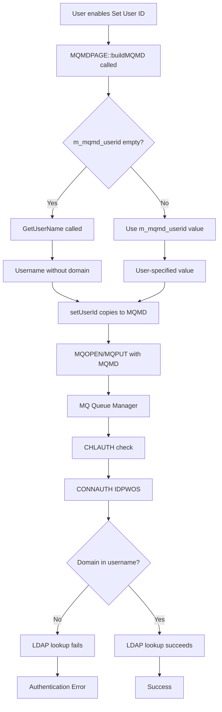

# IDPWOS Authentication Issue Analysis

## Issue Summary

When using IDPWOS (ID/Password OS) authentication with CHLAUTH and CONNAUTH configured to use LDAP via `SYSTEM.DEFAULT.AUTHINFO.IDPWOS`, the **new RFHUtil version fails authentication** while the **old C version works** from the same host.

## Root Cause Analysis

### The Problem

In [`RFHUtil/MQMDPAGE.cpp:2574-2575`](../RFHUtil/MQMDPAGE.cpp:2574-2575), there's a critical change in how the Windows username is retrieved:

```cpp
// Line 2574: OLD method (commented out)
// rc = GetUserNameEx(NameSamCompatible, userId, &userIdSize);

// Line 2575: NEW method (currently active)
rc = GetUserName(userId, &userIdSize);
```

### Windows API Behavior Differences

| API Function | Format Returned | Example |
|-------------|----------------|---------|
| `GetUserNameEx(NameSamCompatible, ...)` | `DOMAIN\username` | `CONTOSO\bmatt` |
| `GetUserName(...)` | `username` only | `bmatt` |

### Expected vs Actual Behavior

**Old Working Version:**
- Used `GetUserNameEx(NameSamCompatible, ...)` 
- Sent username with domain prefix: `DOMAIN\bmatt`
- Preserved original case from Windows
- LDAP authentication succeeded

**New Broken Version:**
- Uses `GetUserName()`
- Sends username without domain: `bmatt`
- No case transformation applied
- LDAP authentication fails (likely because LDAP expects domain-qualified username)

## Impact Assessment

### Affected Code Locations

1. **Primary Location - MQMD User ID Setting**
   - File: [`RFHUtil/MQMDPAGE.cpp:2570-2581`](../RFHUtil/MQMDPAGE.cpp:2570-2581)
   - Function: Setting user ID in MQMD when `m_setUserID` or `m_set_all` is enabled
   - Impact: Direct authentication failure

2. **Secondary Locations - User ID Usage**
   - [`RFHUtil/DataArea.cpp:7931-7935`](../RFHUtil/DataArea.cpp:7931-7935) - Browse operations
   - [`RFHUtil/DataArea.cpp:8097-8098`](../RFHUtil/DataArea.cpp:8097-8098) - Read operations  
   - [`RFHUtil/DataArea.cpp:14634-14650`](../RFHUtil/DataArea.cpp:14634-14650) - Display queue operations
   - [`RFHUtil/DataArea.cpp:20048-20052`](../RFHUtil/DataArea.cpp:20048-20052) - Pub/Sub get operations

All these locations call `mqmdObj->setUserId(&mqmd)` which ultimately uses the username retrieved by the problematic code.

### Authentication Flow



## Why This Matters for IDPWOS

When MQ is configured with:
- **CHLAUTH** rules enabled
- **CONNAUTH** pointing to `SYSTEM.DEFAULT.AUTHINFO.IDPWOS`
- **LDAP** backend for authentication

The LDAP directory typically stores users in domain-qualified format (e.g., `DOMAIN\username` or `username@domain.com`). When the application sends just `username` without the domain qualifier, the LDAP lookup fails because:

1. LDAP searches for exact match of the provided username
2. Without domain prefix, it cannot find the user entry
3. Authentication is denied even though credentials are valid

## Additional Concerns

### 1. No Case Transformation
The current code does **not** apply any case transformation to the username. While the user confirmed the old version sent it "as-is with domain prefix", some LDAP configurations may be case-sensitive.

### 2. Truncation to 12 Characters
Line 2578 truncates the username to 12 characters:
```cpp
userId[12] = 0;
```

This is problematic because:
- `DOMAIN\username` format easily exceeds 12 characters
- Example: `CONTOSO\bmatt` = 13 characters (would be truncated to `CONTOSO\bmat`)
- MQ's `MQ_USER_ID_LENGTH` is 12 bytes, but domain-qualified names need more space

### 3. Connection User ID vs MQMD User ID
The code has two separate authentication paths:
- **Connection authentication** ([`DataArea.cpp:10676-10740`](../RFHUtil/DataArea.cpp:10676-10740)) - Uses `m_conn_userid` via MQCSP
- **Message context authentication** ([`MQMDPAGE.cpp:2570-2581`](../RFHUtil/MQMDPAGE.cpp:2570-2581)) - Uses Windows username

The issue affects the **message context authentication** path, not the connection authentication.

## Recommended Fix

### Option 1: Restore GetUserNameEx (Recommended)
Uncomment line 2574 and remove line 2575:

```cpp
// Restore domain-qualified username retrieval
rc = GetUserNameEx(NameSamCompatible, userId, &userIdSize);
// rc = GetUserName(userId, &userIdSize);  // Remove this line
```

**Pros:**
- Matches old working behavior
- Provides domain-qualified username for LDAP
- Minimal code change

**Cons:**
- May exceed 12-character limit (needs buffer size increase)
- Requires Windows XP or later (already a requirement)

### Option 2: Make it Configurable
Add an environment variable or registry setting to choose between formats:

```cpp
char* useFullName = getenv("RFHUTIL_USE_DOMAIN_USERNAME");
if (useFullName && (strcmp(useFullName, "1") == 0)) {
    rc = GetUserNameEx(NameSamCompatible, userId, &userIdSize);
} else {
    rc = GetUserName(userId, &userIdSize);
}
```

**Pros:**
- Backward compatible
- Flexible for different environments

**Cons:**
- More complex
- Requires user configuration

### Option 3: Increase Buffer Size
Change the buffer and truncation logic to accommodate domain-qualified names:

```cpp
char userId[256];  // Increase from implicit 12+
DWORD userIdSize = sizeof(userId);
rc = GetUserNameEx(NameSamCompatible, userId, &userIdSize);
if (rc != 0) {
    // Truncate to MQ_USER_ID_LENGTH if needed
    userId[MQ_USER_ID_LENGTH] = 0;
    setUserId(mqmd);
}
```

**Pros:**
- Handles longer usernames
- More robust

**Cons:**
- Still truncates if domain\username > 12 chars
- May cause authentication issues if truncated

## Testing Recommendations

### Test Environment Setup
1. Configure MQ Queue Manager with:
   - CHLAUTH rules enabled
   - CONNAUTH pointing to IDPWOS auth info object
   - LDAP backend configured

2. Create test users in LDAP with domain-qualified names

### Test Cases

| Test Case | Configuration | Expected Result |
|-----------|--------------|-----------------|
| TC1 | Old RFHUtil C version | Authentication succeeds |
| TC2 | New RFHUtil with current code | Authentication fails |
| TC3 | New RFHUtil with GetUserNameEx | Authentication succeeds |
| TC4 | Username > 12 chars | Verify truncation behavior |
| TC5 | No domain in LDAP | Verify fallback behavior |

### Verification Steps
1. Enable MQ trace to capture authentication attempts
2. Check LDAP server logs for lookup attempts
3. Verify username format sent to MQ
4. Test with both local and domain accounts

## Related Code References

- Connection authentication: [`DataArea.cpp:10676-10740`](../RFHUtil/DataArea.cpp:10676-10740)
- MQCSP structure usage: [`DataArea.cpp:10588`](../RFHUtil/DataArea.cpp:10588)
- User ID setting in MQMD: [`MQMDPAGE.cpp:4005-4027`](../RFHUtil/MQMDPAGE.cpp:4005-4027)
- Alternate user authority: [`DataArea.cpp:11810-11828`](../RFHUtil/DataArea.cpp:11810-11828)

## Conclusion

The authentication failure is caused by switching from `GetUserNameEx()` to `GetUserName()`, which removes the domain prefix from the username. This breaks LDAP authentication that expects domain-qualified usernames.

**Recommended Action:** Restore `GetUserNameEx(NameSamCompatible, ...)` and increase the buffer size to accommodate domain-qualified usernames.